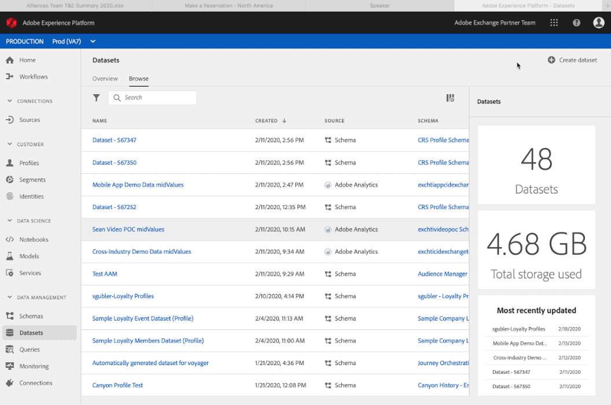

# 建立方案和資料集

此 [Postman集合](https://github.com/Adobe-Marketing-Cloud/exchange-aep-profile-integration-postman) 整篇文章都會使用相關的呼叫次數來參照。 有關安裝和使用Postman集合的詳細資訊，請參閱Github [讀我檔案](https://github.com/Adobe-Marketing-Cloud/exchange-aep-profile-integration-postman/blob/master/README.md) 頁面。 也有範例資料集 [忠誠度](https://github.com/Adobe-Marketing-Cloud/exchange-aep-profile-integration-postman/blob/master/AEP%20loyalty%20events.json) 和 [設定檔](https://github.com/Adobe-Marketing-Cloud/exchange-aep-profile-integration-postman/blob/master/AEP%20loyalty%20profiles.json) 資料。

## 結構描述

結構是一組規則，可代表及驗證資料的結構和格式。 在高層面上，結構描述會提供真實世界物件（例如人）的抽象定義，並概述該物件的每個例項中應該包含哪些資料（例如名字、姓氏、生日等）。 可在UI中或使用以下方式建立方案 [!DNL Experience Platform] API。

另請參閱 [本檔案](https://www.adobe.io/apis/experienceplatform/home/xdm/xdmservices.html#!api-specification/markdown/narrative/technical_overview/schema_registry/schema_composition/schema_composition.md) 以取得更多詳細資料。

### 建立結構描述

合作夥伴可以使用UI建立結構描述，方法是遵循以下步驟： [教學課程](https://docs.adobe.com/content/help/zh-Hant/experience-platform/xdm/tutorials/create-schema-ui.html). 此範例使用熟客方案設定檔結構描述。 雖然設定檔結構描述是此範例，但使用類似程式即可使用事件型結構描述。

若要使用API，合作夥伴必須具備與的現有Adobe I/O整合 [!DNL Experience Platform] 許可權已啟用。 請參閱本指南，前往 [建立I/O整合](https://www.adobe.io/apis/experienceplatform/home/tutorials/alltutorials.html#!api-specification/markdown/narrative/tutorials/authenticate_to_acp_tutorial/authenticate_to_acp_tutorial.md).

然後造訪 [此連結](https://docs.adobe.com/content/help/en/experience-platform/xdm/tutorials/create-schema-api.html) 以瞭解如何使用API建置結構描述。

若要透過Postman建立架構，請使用資料夾1：建立架構、1a：為PROFILE資料建立架構或1b：為EVENT資料建立架構中所包含的呼叫。

## 資料集

所有進入Adobe的資料 [!DNL Experience Platform] 包含在資料集中。 資料集是資料集合的儲存和管理結構，通常是包含方案 (欄) 和欄位 (列) 的表格。 資料集也包含中繼資料，可說明其儲存資料的各個層面。

目錄服務是內資料位置和歷程的記錄系統 [!DNL Experience Platform]、和可用來建立及管理資料集。 目錄會追蹤每個資料集的中繼資料，包括資料集所符合（下一節將說明）的Experience Data Model (XDM)結構描述參考，以及擷取至該資料集的記錄數。

前往 [此處](https://docs.adobe.com/content/help/en/experience-platform/catalog/datasets/overview.html) 以取得詳細的資料集總覽。

### 建立資料集

<!-- 
We don't yet support hover text in images (and we render it poorly when included). I removed "Creating a Dataset" from the above image link. We can add it back when we support it (Summer 2020?) -Bob
-->

透過UI建立資料集：

1. 按一下 **[!UICONTROL 建立資料集]**.

1. 按一下 **[!UICONTROL 從結構描述建立]**.

1. 按一下&#x200B;**[!UICONTROL 完成]**。

前往 [此處](https://docs.adobe.com/content/help/en/experience-platform/catalog/datasets/user-guide.html) 適用於資料集使用手冊。

[使用API建立資料集](https://docs.adobe.com/content/help/en/experience-platform/catalog/datasets/create.html).

若要透過Postman建立資料集，請使用資料夾2：建立資料集、2a：為「設定檔」資料建立資料集，或2b：為「事件」資料建立資料集。

## 合作夥伴適用的結構和資料集最佳實務

* 合作夥伴資料應該使用單獨的設定檔結構描述，而不是為客戶現有的設定檔結構描述和體驗結構描述建立混合資料。
* 合作夥伴應儘可能使用Adobe類別和混合功能。
* 合作夥伴應使用個別資料集上傳其資料，而不是嘗試將其資料合併至現有資料集。
* 合作夥伴目前無法將其結構描述上傳至全域登入。
